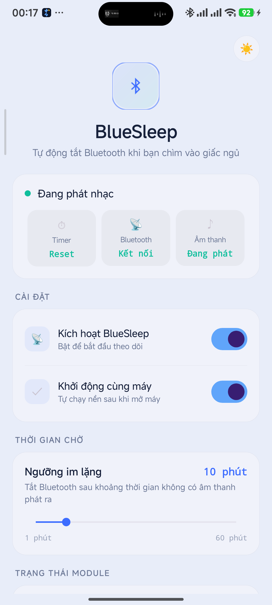
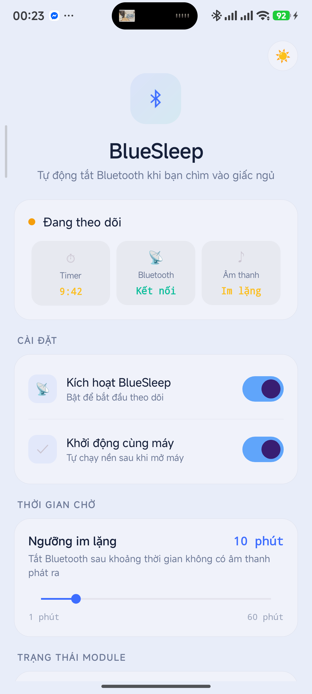

# 🌙 BlueSleep

**Tự động tắt Bluetooth khi bạn chìm vào giấc ngủ.**

BlueSleep theo dõi âm thanh trên thiết bị — khi không còn gì đang phát trong khoảng thời gian cài đặt, Bluetooth sẽ tự động tắt hoàn toàn. Tai nghe ngắt kết nối, tự tắt nguồn, tiết kiệm pin qua đêm.

---

## Screenshots

<p align="center">
  
  &nbsp;
  
  &nbsp;
  
</p>
<p align="center">
  <em>Chờ kết nối → Đang phát nhạc → Đếm ngược tắt Bluetooth</em>
</p>

---

## Tại sao cần BlueSleep?

Bạn nghe nhạc, podcast hay ASMR qua tai nghe Bluetooth trước khi ngủ. Nội dung phát xong (YouTube sleep timer, Spotify,...) nhưng Bluetooth vẫn bật → tai nghe vẫn kết nối → hết pin qua đêm.

**BlueSleep giải quyết đúng vấn đề đó.**

---

## Tính năng

| | |
|---|---|
| 🎵 **Theo dõi audio realtime** | Phát hiện ngay khi nhạc dừng |
| ⏱️ **Timer tùy chỉnh** | 1–60 phút, đếm ngược mỗi giây |
| 📡 **Tắt BT triệt để** | Root command + kill BT process, không bị hệ thống bật lại |
| 🔄 **Tự khởi động** | Chạy nền ngay khi mở máy |
| 🛡️ **LSPosed module** | Chống force-stop bởi hệ thống (tùy chọn) |
| 🌓 **Light / Dark mode** | Giao diện sáng mặc định, chuyển đổi 1 chạm |

---

## Yêu cầu

- Android 8.0+ (API 26)
- **Root** — Magisk, KernelSU, hoặc giải pháp root khác
- **LSPosed** *(tùy chọn)* — chỉ cần nếu hệ thống hay tự tắt app

---

## Cài đặt

1. Tải APK từ [Releases](https://github.com/kaharachan/BlueSleep/releases)
2. Cài đặt lên thiết bị
3. Mở trình quản lý root → **cấp quyền root cho BlueSleep**
4. *(Tùy chọn)* LSPosed Manager → bật module → chọn: `Framework hệ thống` → reboot

---

## Cách hoạt động

```
Bluetooth kết nối  →  Nhạc đang phát?
                          │
                    ┌─────┴─────┐
                   Có          Không
                    │            │
              Reset timer   Đếm ngược
                                │
                          Timer hết?
                          │        │
                        Không     Có
                          │        │
                     Tiếp tục   Tắt Bluetooth
                     đếm        hoàn toàn ✓
```

**Chi tiết kỹ thuật:**
- Foreground Service chạy trên background thread (HandlerThread), tránh ANR
- WakeLock tự động gia hạn mỗi giờ, tiết kiệm pin khi không hoạt động
- BT connection check mỗi 30s qua `dumpsys bluetooth_manager`, fallback sang Android API
- Tắt BT 4 bước: disable BLE scan → `svc bluetooth disable` → `settings put global bluetooth_on 0` → kill `com.android.bluetooth`
- Xác minh trạng thái BT thực tế sau khi tắt, thử lại nếu thất bại
- Toàn bộ lệnh root có timeout 10s, tránh treo app
- Quyền được kiểm tra trước khi khởi động service (Activity Result API)

---

## Về LSPosed Module

Module hook nhiều lớp bảo vệ trong Android framework:
- `forceStopPackage` / `forceStopPackageAsUser` — chặn buộc dừng
- `killBackgroundProcesses` — chặn kill nền
- `removeTask` — chặn xóa task khỏi recents (bảo vệ khi "clear all" trên MIUI/HyperOS)
- `setPackageStoppedState` — ngăn đánh dấu app là "stopped"
- `systemReady` — tự khởi động service sau boot

Lưu ý:
- Đây là API nội bộ Android, có thể thay đổi giữa các ROM và phiên bản
- Không bảo vệ khỏi Low Memory Killer hoặc kernel kill
- Hoàn toàn tùy chọn — app vẫn hoạt động bình thường chỉ với root

---

## Build từ source

```bash
git clone https://github.com/kaharachan/BlueSleep.git
cd BlueSleep
./gradlew assembleRelease
```

> **Lưu ý:** Cần tạo file `keystore.properties` ở root project với nội dung:
> ```
> storeFile=keystore.jks
> storePassword=<mật khẩu>
> keyAlias=<alias>
> keyPassword=<mật khẩu>
> ```
> Cần Android SDK với `platforms/android-34` và `build-tools`.

---

## Cấu trúc project

```
app/src/main/java/com/bluesleep/module/
├── MainActivity.java          UI (programmatic, không XML layout)
├── AudioMonitorService.java   Foreground service + background thread monitor
├── XposedEntry.java           LSPosed hook chống force-stop + kill + clear all
├── BootReceiver.java          Auto-start khi boot
├── HeartbeatReceiver.java     AlarmManager heartbeat mỗi 5 phút
└── ServiceRestartWorker.java  WorkManager backup restart mỗi 15 phút
```

---

## Tech

Java · Programmatic UI · Material 3 · Xposed API · Gradle 8.11.1 · AGP 8.7.3 · compileSdk 34

---

## License

MIT
